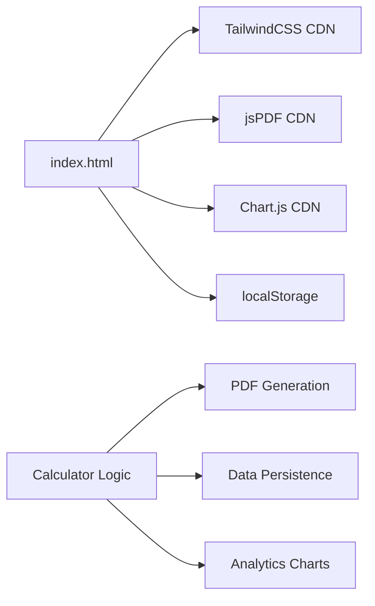
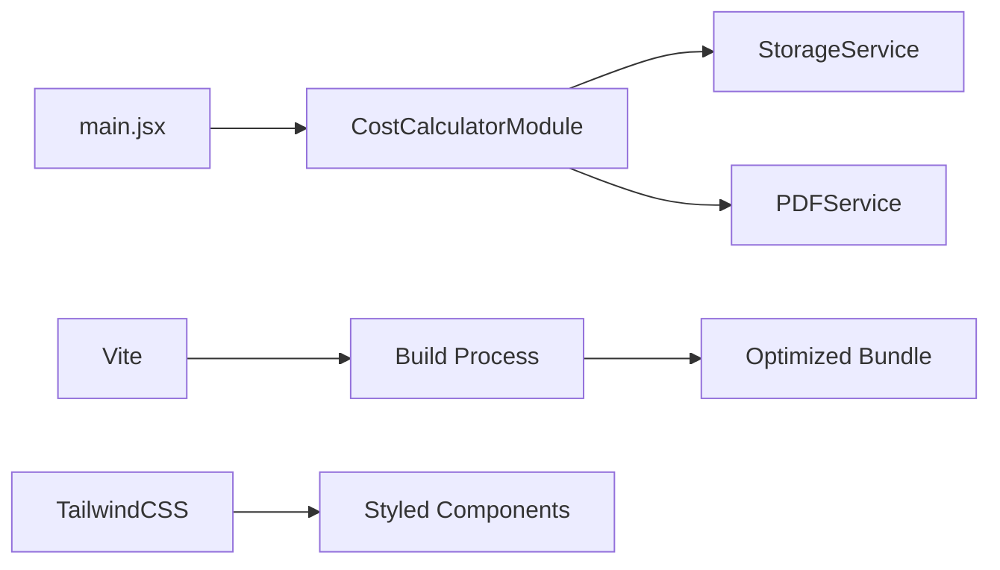
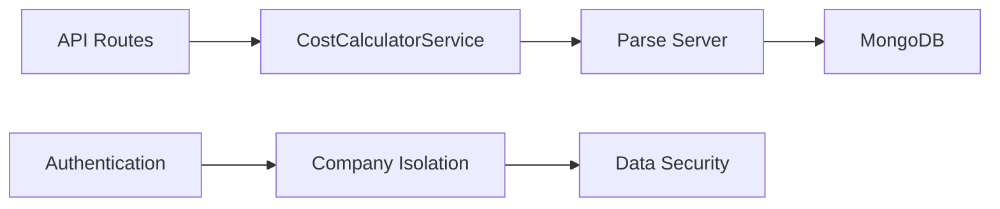

# 📚 Documentação Técnica - Calculadora de Custos

## 🗂️ Estrutura de Arquivos Completa

```
calculadora-custos/
├── index.html                     # 🌐 Aplicação standalone (HTML puro)
├── react.html                     # ⚛️ Entrada para versão React
├── package.json                   # 📦 Dependências e scripts
├── vite.config.js                 # ⚙️ Configuração do Vite
├── tailwind.config.js             # 🎨 Configuração do TailwindCSS
├── postcss.config.js              # 🎯 Configuração do PostCSS
├── README.md                      # 📖 Documentação principal
├── DEPLOY.md                      # 🚀 Instruções de deploy
├── INTEGRATION.md                 # 🔌 Documentação de integração
├── easypanel.json                 # ☁️ Config para EasyPanel
├── .gitignore                     # 🚫 Arquivos ignorados pelo Git
│
├── src/                           # 📁 Código React
│   ├── main.jsx                   # 🚪 Ponto de entrada React
│   ├── components/                # 🧩 Componentes React
│   │   └── CostCalculatorModule.jsx  # 🧮 Módulo principal
│   ├── services/                  # 🔧 Serviços
│   │   ├── StorageService.js      # 💾 Gerenciamento de dados
│   │   └── PDFService.js          # 📄 Geração de PDFs
│   ├── styles/                    # 🎨 Estilos
│   │   └── index.css              # 🎯 CSS principal com TailwindCSS
│   └── modules/                   # 📋 Configurações
│       └── config.js              # ⚙️ Configurações do sistema
│
└── backend/                       # 🔌 API Backend (opcional)
    ├── services/                  # 🔧 Lógica de negócio
    │   └── CostCalculatorService.js  # 🧮 Service do Parse Server
    └── routes/                    # 🛣️ Rotas da API
        └── costCalculator.js      # 📡 Endpoints da API
```

## 🎯 Versões e Casos de Uso

### 1. 📄 Versão Standalone (`index.html`)

**Quando usar:**
- Deploy rápido em servidor estático
- Projeto simples sem complexidade
- Demonstração ou protótipo
- Cliente quer solução "plug-and-play"

**Características:**
```javascript
✅ Zero configuração
✅ Funciona offline
✅ CDNs externos (TailwindCSS, jsPDF, Chart.js)
✅ localStorage para persistência
✅ Responsivo e moderno
```

**Deploy:**
```bash
# Apenas copie o arquivo
cp index.html /var/www/html/
# Ou use o EasyPanel com static site
```

### 2. ⚛️ Versão React (`src/`)

**Quando usar:**
- Integração com sistema existente
- Desenvolvimento em equipe
- Necessidade de customização
- Workflow moderno (TypeScript, ESLint, etc.)

**Características:**
```javascript
✅ Componentes modulares
✅ Build otimizado com Vite
✅ Hot reload em desenvolvimento
✅ Fácil manutenção e extensão
✅ Integração com Context API
```

**Setup:**
```bash
npm install
npm run dev     # Desenvolvimento
npm run build   # Produção
```

### 3. 🔌 Versão Backend (`backend/`)

**Quando usar:**
- Sistema multi-usuário
- Dados compartilhados
- Autenticação necessária
- Relatórios centralizados

**Características:**
```javascript
✅ Parse Server integration
✅ Autenticação e permissões
✅ API REST completa
✅ Isolamento por empresa
✅ Analytics centralizados
```

## 🔧 Arquitetura Técnica

### Frontend (Standalone)


### Frontend (React)


### Backend (Parse Server)


## 📋 APIs e Interfaces

### StorageService (Frontend)
```javascript
class StorageService {
    // Salvar dados da empresa
    static async saveCompanyData(companyId, module, data)
    
    // Recuperar dados da empresa
    static async getCompanyData(companyId, module)
    
    // Limpar dados
    static async clearCompanyData(companyId, module)
}
```

### PDFService (Frontend)
```javascript
class PDFService {
    // Gerar relatório PDF
    static async generateReport(project)
    
    // Configurar layout
    static configureLayout(doc, project)
    
    // Adicionar gráficos
    static addCharts(doc, analytics)
}
```

### CostCalculatorService (Backend)
```javascript
class CostCalculatorService {
    // Criar projeto
    static async createProject(companyId, projectData)
    
    // Listar projetos
    static async getProjects(companyId, filters)
    
    // Analytics
    static async getAnalytics(companyId, period)
}
```

## 🎨 Customização

### Cores e Tema
```javascript
// tailwind.config.js
theme: {
  extend: {
    colors: {
      'calculator': {
        50: '#eff6ff',
        500: '#3b82f6',
        900: '#1e3a8a',
      }
    }
  }
}
```

### Configurações
```javascript
// src/modules/config.js
export const defaultConfig = {
  materiais: {
    papel: { nome: 'Papel Sublimático', preco: 0.50 },
    tinta: { nome: 'Tinta Sublimática', preco: 2.00 }
  },
  maoDeObra: 15.00,
  margem: 40
};
```

## 🔧 Extensões Possíveis

### 1. PWA (Progressive Web App)
```javascript
// Adicionar service worker
// Manifest.json
// Cache estratégico
```

### 2. Integrações
```javascript
// WhatsApp API para compartilhar orçamentos
// Stripe/PagSeguro para pagamentos
// Google Drive para backup
// Email automation
```

### 3. Analytics Avançados
```javascript
// Google Analytics
// Métricas customizadas
// Dashboards executivos
// Relatórios automatizados
```

## 🚀 Performance

### Otimizações Aplicadas
- ✅ Lazy loading de componentes
- ✅ Code splitting automático (Vite)
- ✅ CDNs para bibliotecas externas
- ✅ Minificação e compressão
- ✅ Cache estratégico no localStorage

### Métricas Esperadas
- 📊 First Contentful Paint: < 1.5s
- 📊 Largest Contentful Paint: < 2.5s
- 📊 Bundle size: < 500KB
- 📊 Lighthouse Score: > 90

## 🔒 Segurança

### Frontend
- ✅ Sanitização de inputs
- ✅ Validação client-side
- ✅ Dados locais (localStorage)
- ✅ HTTPS obrigatório

### Backend
- ✅ Autenticação JWT
- ✅ Isolamento por empresa
- ✅ Validação server-side
- ✅ Rate limiting
- ✅ CORS configurado

---

**📧 Suporte**: Para dúvidas técnicas, consulte a documentação ou entre em contato.
